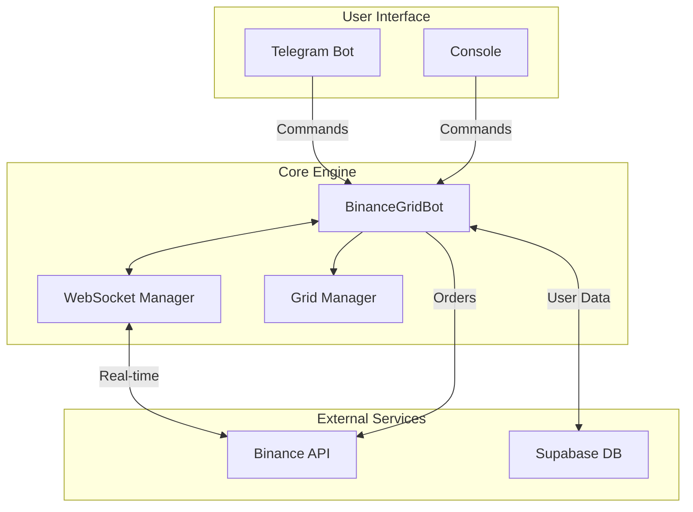

# HyperGridBot 🤖📈

[](https://python.org)
[](LICENSE)
[](https://binance.com)

A high-frequency grid trading bot for Binance Futures with real-time WebSocket integration, Telegram control interface, and multi-user SaaS architecture.

## 🎯 Features

- **Grid Trading Engine** - Automated buy-low/sell-high strategy with configurable parameters
- **Real-time WebSockets** - Sub-second price updates and order fills
- **Telegram Control** - Inline keyboard buttons for remote bot management
- **Trading Presets** - NEUTRAL, ULTRA_SAFE, and AGGRESSIVE strategies
- **Multi-User Ready** - Isolated instances with encrypted API key storage
- **Auto-Recovery** - Automatic reconnection and grid recentering
- **Safety Features** - Liquidation alerts, drawdown protection, crash detection

## 🏗️ Architecture



## 🚀 Quick Start

### Prerequisites
- Python 3.9+
- Binance account (Testnet for demo)
- Telegram bot token (optional)

### Installation

```bash
# Clone repository
git clone https://github.com/EmmanuelDumitrache/hypergrid.git
cd hypergrid

# Install dependencies
pip install -r requirements.txt

# Configure environment
cp .env.example .env
# Edit .env with your API keys
```

### Demo Mode (Testnet)

```bash
# Run with testnet (no real money)
./run_demo.sh
```

### Production

```bash
python binance_bot.py
```

## ⚙️ Configuration

Edit `config.json`:

```json
{
  "grid": {
    "pair": "BNBUSDT",
    "capital": 2000,
    "leverage": 3,
    "grids": 5,
    "spacing_pct": 0.001
  }
}
```

### Trading Presets

| Preset | Grids | Spacing | Leverage | Risk |
|--------|-------|---------|----------|------|
| NEUTRAL | 5 | 0.10% | 3x | Medium |
| ULTRA_SAFE | 3 | 0.20% | 2x | Low |
| AGGRESSIVE | 8 | 0.05% | 5x | High |

## 📱 Telegram Commands

| Button | Action |
|--------|--------|
| 📊 Status | Current price, PnL, position |
| 📈 PnL | Detailed profit breakdown |
| ⏸ Pause | Halt trading |
| ▶️ Resume | Resume trading |
| 🎚 Preset | Change trading strategy |

## 🔒 Security

- API keys encrypted with AES-256-GCM
- Environment variables for secrets
- No keys stored in code or logs
- Row-level security in Supabase

## 📁 Project Structure

```
hypergrid/
├── binance_bot.py      # Main bot logic
├── config.json         # Trading configuration
├── src/
│   ├── binance_adapter.py   # Exchange interface
│   ├── telegram_bot.py      # Telegram integration
│   ├── websocket_manager.py # Real-time connections
│   ├── user_manager.py      # Multi-user support
│   ├── crypto_utils.py      # Encryption utilities
│   └── supabase_client.py   # Database client
├── api/
│   └── subscription.py      # Vercel serverless API
└── supabase/
    └── schema.sql           # Database schema
```

## 🛠️ Tech Stack

- **Backend**: Python 3.9+
- **Exchange**: Binance Futures API
- **Real-time**: WebSockets (python-binance)
- **Database**: Supabase (PostgreSQL)
- **API**: Vercel Serverless Functions
- **Bot**: Telegram Bot API
- **Encryption**: cryptography (AES-256-GCM)

## ⚠️ Disclaimer

This software is for educational purposes. Trading cryptocurrencies involves substantial risk. Past performance does not guarantee future results. Use at your own risk.

## 📄 License

MIT License - see [LICENSE](LICENSE) for details.

---

Built with ☕ and 🎵
